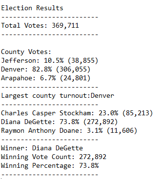

# Election Analysis
Columbia Data Science Module 3

## Project Overview
In this project, Tom of the Colorado Board of Elections has tasked me with auditing the election results for Colorado's 1st Congressional District. Using Python, I have been tasked with coming up with the following figures for the race: 
1) the total number of votes cast
2) votes broken down by county in absolute terms and as percentages
3) the county with the largest number of votes cast
4) a breakdown of the number and percentage of votes cast by candidate
5) the winner of the popular vote, along with the number of votes they received and their share of the vote total

## Resources
Data source: election_results.csv

Software: Visual Studio Code 1.52.1, Python 3.8.6

## Election Audit Results
* **Total votes cast in election**

369,711

* **Votes by county**

|County|Votes|Share of vote count|
|------|-----|-------------------|
|Jefferson|38,855|10.5%|
|Denver|306,055|82.8%|
|Arapahoe|24,801|6.7%|

* **County with the most votes**

Denver

* **Votes by candidate**

|Candidate|Votes|Share of vote count|
|---------|-----|-------------------|
|Charles Casper Stockham|85,213|23.0%|
|Diana DeGette|272,892|73.8%|
|Raymon Anthony Doane|11,606|3.1%|

* **Winning candidate**

Diana DeGette won the election with 272,892 votes, which represents 73.8% of all ballots cast. 

The full .txt readout of the analysis looks like this and can be found [here:](https://github.com/perryabdulkadir/Election-Analysis/blob/main/analysis/election_results.txt)




## Election Audit Summary

Currently, this script could be used to analyze any other election where the data is collected on the ballot level, the county name is in the 2nd column, and the candidate name is in the third column. 

The process for changing the script to work on similarly structured data for a municipal election would be quite simple. Imagine instead of a using this script for a Congressional race in Colorado we instead used it for a mayoral race in Denver. If this dataset instead had votes broken down by precinct rather than county, it would be simple to change. While not strictly necessary, it would be best practice to rename all county variables to things like "precinct_name," "precinct_list," and "precinct_dict" etc.

The only absolutely necessary change for the end user would be changing the print text from
```
 print("Largest county turnout:", largest_county, "\n")
 ```
 to
 
```
 print("Largest precinct turnout:", largest_precinct, "\n")
```

